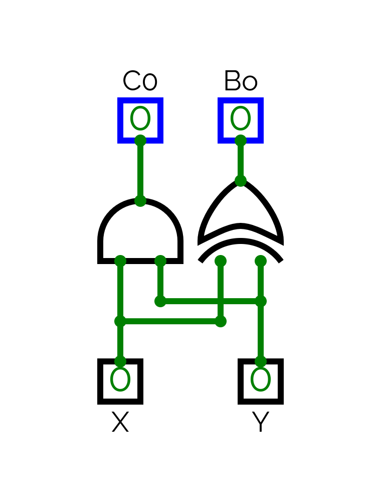

<!-- boring boilerplate -->

# Briefing

In this "*document*" (markdown because im too different), *low level* yet "*easy to understand*" information about the CPU can be found. The main focus of this document is more about ***how it works*** than *what it is*. Because come on like I know that you know what a CPU is. But I'm sure you don't know how the CPU makes that 010101011110110100101010011 make a rectangle appear on your screen (though wont be talking about that, sucks to suck i guess).

# What is a CPU?

The *CPU* (or *Central Processing Unit*) is the *brain of the computer* and handles **almost everything**. The things you see on your monitor, the audio your computer plays, registering your keyboard keys and whatnot.

# History

It's origin came form the *ENIAC*, the first computer ever created. It was made in 1945 by *John Mauchly* and *J. Presper Eckert* and was able to do basic arithmetic operations but more importantly calculate artillery firing tables (which explains its creation date, though it finished construction after the war). It was hard to use as it required you to manually wire each instruction.

<!-- yes this is staying -->
i couldnt be bothered to add more history its like literally the same afterwards.
if i do start talking about more stuff it will get super complicated like ever heard of an SIMD?

# How does a CPU work?

The CPU runs instructions of a program. Which it separates into two main components, being:

* CU (Control Unit)
* ALU (Arithmetic and Logical Unit)

## Talking binary

If you've ever thought the computer is so smart, wrong answer son. The computer can't even comprehend a decimal number it can only think yes or no. Try telling the CPU 31, it will probably explode (i mean it cant ???).

In all seriousness, the computer stores any and all information in binary. Which is just saying numbers are stored in base 2. Why not store anything as any value? I have no idea. Though that's probably because you just cant. So everything defaults to a flexible and fast (and can exist) base.

### Storing information

Information can be stored this way because any form of number(s) can be mapped to any kind of information.

Take the text you see on the screen for example. They use a standard called ASCII (or UTF-8 but that's complicated) which just binds every possible byte (i.e any combination of 8 0s and 1s) to a single character, such as 'A' being 65 (or 01000001).

Or take bitmap images, which stores 4 bytes for each pixel measuring its red, green and blue value with an additional alpha/transparency variable.

#### Oh wow let me guess the programs are in binary too

This also implies that ALL applications you use are also in binary. Since the CPU won't understand anything when you say "*hack europe chat system and make my opsec god level*", you have to give it instructions that it CAN understand. And all the applications you use are just a giant chain of these instructions.

##### Compilers

The programs are written and then turned into machine code using something called a compiler.

The compiler is not one but many things. Though they're irrelevant. It's main purpose is to turn the code you wrote into intermediate mode or assembly code, which is basically more human readable version of raw instructions, and then turn that assembly code into machine code.

And voila, software.

## Arithmetic and Logical Unit

ALU performs arithmetic (duh) and logical (DUH) operations given through the registers and then stored there.

It performs these actions via Logic Gates, you know, the ones you learnt from 10th grade physics? Since computers can't do math (let alone comprehend decimal numbers) they have to rely on pure logic for arithmetic operations.

Like they can't just "add" to sets of 0s and 1s. Hell it doesn't even know what "adding" is. All it sees are just those numbers.

<!-- one piece pacing lol -->

So adding is handled via logic, but how?

### Random addition explanation

The addition is handled by running the two bits of the numbers with equal magnitude via a "Full Adder" with a carry in if the last operation created one. So if you have two 32 bit numbers, you have to run the Full Adder on all 32 bits.

And they wouldn't be called "Full Adder" if there wasn't, ***perchance***, a "Half Adder".

The half adders get two bits as input and outputs a bit and a carry out. It is wired as such:

<!-- insert some cool ass logic circuit -->

It works because the carry out should only be 1 IF the two bits are also 1, resulting X & Y. Where as the output bit only becomes 1 IF either one of the X or Y was also one. But IF we use AND and OR, we get an issue when both X and Y are 1. Which makes the carry 1 and the output bit 1 (which is obviously wrong because its the same as saying 1 + 1 = 3). Which means we have to exclude the scenario of bit out being 1 when both X and Y are 1, sounds kinda like XOR to me. Resulting in a beautiful circuit of PURE logic.

Its truth table looks as such:

| X | Y | Co | Bo |
| - | - | -- | -- |
| 0 | 0 | 0  | 0  |
| 1 | 0 | 0  | 1  |
| 0 | 1 | 0  | 1  |
| 1 | 1 | 1  | 0  |

The Full Adder expands on this, taking another input. A carry IN. So this time it takes X, Y and carry in and outputs bit out and carry out. And is wired as such:

The funny thing is, it just adds another half adder and ORs the output of both carry outs from the half adders. Besides two halves should create a whole.

Here is the truth table for reference:

| X | Y | Ci | Co | Bo |
| - | - | -- | -- | -- |
| 0 | 0 | 0  | 0  | 0  |
| 1 | 0 | 0  | 0  | 1  |
| 0 | 1 | 0  | 0  | 1  |
| 0 | 0 | 1  | 0  | 1  |
| 1 | 1 | 0  | 1  | 0  |
| 1 | 0 | 1  | 1  | 0  |
| 0 | 1 | 1  | 1  | 0  |
| 1 | 1 | 1  | 1  | 1  |

Pretty cool huh? You can assume that every other operation has their own logics too.

## Control unit

CU, unlike the ALU is more interesting because it handles fetching data from memory, decoding and executing instructions. Being a manager of sorts, even sets up registers and what not for the ALU.

"Memory? Registers?? Instructions??? What even are you blabbering about?". Okay bucko.

## Memory basics

Say you want to remember a number she gave you. So it's loaded into your short term memory and you're all fluttered and now it gets into your long term memory. After a while you decide to call her. "What's her number again?", and after a while her number gets loaded from the long term memory and into your short term memory. And with the number, you make your other move.

What..? You're a human being? I thought you were a CPU.

Yeah this is how a computers memory actually works, everything stored in your hard drive is technically long term memory (i.e slower and long lasting) and the ram sticks the AI is feeding on is its short term memory (i.e fast and always circulating). And we're focusing on the short term memory.

a girl gave you her number? cant remember that happening

It consists of raw data and instructions by the same applications you're running, yes they load the executable into ram first.

### Registers

The CPU keeps track of variables such as the registers which are super fast memory type built directly into the CPU.

There are many types of registers such as Program Counter which points to the current instruction that's about to be executed=

<!-- TODO: get into more details -->

## Instructions

<!-- TODO: get into more details -->

### Instructing

<!-- TODO: get into more details -->

# Source's used

* [Wikipedia page for Central Processing Unit](https://en.wikipedia.org/wiki/Central_processing_unit)
* [Wikipedia page for ENIAC](https://en.wikipedia.org/wiki/ENIAC)
* [CPU article by freeCodeCamp](https://www.freecodecamp.org/news/how-does-a-cpu-work/)
* [Where Does The CPU Start Executing Code?](https://www.youtube.com/watch?v=WLixwlcVm5Y)

<!-- im noticing that i dont really know much about cpus -->
<!-- dang i love finding out more of the things i like -->
<!-- and doing this made me realize i actually suck at it -->
<!-- meaning i need to learn more -->

<!-- vim: set wrap linebreak spell : -->
